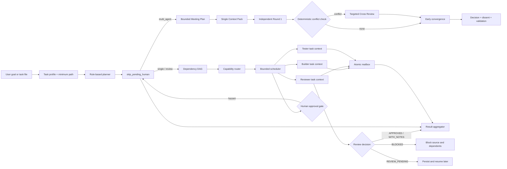

# Multi-Agent Collaboration Architecture

## Scope

The FlowFoundry Multi-Agent MVP coordinates bounded local tasks. It does not
create an unconstrained autonomous conversation loop and it does not make real
provider calls by default. The durable unit is a run manifest plus individually
addressable task state, messages, reviews, approvals, artifacts, and reports.



## Modules and responsibility

| Module | Responsibility |
|---|---|
| `models` | Versionable Agent, Task, Plan, ProviderResult, status, risk, and review vocabulary |
| `intelligence` | No-model task profile and single / reviewed / team path selection |
| `registry` | Agent metadata, capability/permission matching, role preference, history, cost preference, fallback, and concurrency limits |
| `planner` | Adaptive bounded plans and explicit JSON DAG loading |
| `router` | Deterministic task-to-agent selection |
| `providers` | Fake/dry, deterministic local command, Codex, and Claude-compatible structured seams |
| `execution` | Durable per-attempt native process identity, process-group lifecycle, graceful cancellation, escalation, and safe status projection |
| `isolation` | Immutable-base Git worktree allocation, durable ownership, exclusive writer leases, candidate diffs, reconciliation, and conservative cleanup |
| `discovery` / `provider_setup` | Runtime/auth-state inspection and on-demand setup artifacts without credential values |
| `workspace` | Contained run paths, schema version, 0700 directories, 0600 atomic redacted files, and manifest locking |
| `mailbox` | Locked, ordered, schema-versioned agent messages |
| `approvals` / `policies` | Default human gates for dangerous action classes |
| `scheduler` | Dependency readiness, parallel independent tasks, writer assignment, candidate handoff/validation, per-agent concurrency, retry, review transitions, and skip propagation |
| `meeting` | Durable states, one bounded context pack, independent views, zero-model conflict rules, selective cross-review, convergence, budgets, cancellation, and resume receipts |
| `evaluator` | `APPROVED`, `APPROVED_WITH_NOTES`, `BLOCKED`, and `REVIEW_PENDING` record protocol |
| `recovery` | Interrupted-state repair, explicit retry, and input-hash reconciliation |
| `aggregator` | Completed/unfinished tasks, tests, risks, human actions, generated files, commits, and next step |
| `memory` | Minimum-sample agent/category success, retry, latency, token, cost, and review statistics |
| `cli` | Additive `flowfoundry team` interface; existing project/cc/aiproj behavior is unchanged |

## Agent registry

Every agent declares an ID, display name, provider/model/mode, role hint,
capabilities, tools, ability hints, command template, cost class, concurrency
limit, permission profile, context/privacy/locality metadata, availability,
authentication state, reliability/quota fields, workspace mode, and enabled
flag. The bundled examples
are `codex-builder`, `deepseek-reviewer`, `claude-architect`, and
`local-tester`.

Capabilities and permissions are hard requirements; role is a preference, not a
provider lock. Real agents are unavailable by default. Offline runs create an in-memory
synthetic view of the registry and route the same identities through the fake
provider. This tests routing without implying that a provider account or binary
is configured.

## Planning and scheduling

Task plans are dependency ordered and schema-versioned. Each task includes its
dependencies, role, required/preferred capabilities, inputs, expected outputs,
risk, approval requirements, validation commands, retry bound, timeout metadata,
and optional fallback agent. Explicit plans may include independent tasks; the
scheduler executes ready tasks in parallel while a semaphore enforces each
agent's concurrency limit. A concrete execution policy resolves to `none`,
`read_only`, or `managed_worktree`. Real tasks requiring `write_workspace`
receive a managed worktree; read-only tasks do not allocate one. Meeting rounds
remain read-oriented and do not allocate worktrees.

A generated plan is selected from:

```text
simple:       build → aggregate
risk/quality: build → review → aggregate
complex:      bounded meeting → [validation] → aggregate
```

Adaptive `multi_agent` plans carry a `MeetingPlan`; explicit legacy JSON DAGs
without one keep their existing execution semantics. Participant tasks describe
required capabilities, while the Registry chooses the actual Agent. Providers
are not hard-coded to roles.

The meeting state machine is:

```text
PLANNED → CONTEXT_READY → ROUND1_RUNNING → ROUND1_COMPLETE
        → CONFLICT_CHECKED → [ROUND2_RUNNING → ROUND2_COMPLETE]
        → CONVERGING → [VALIDATING] → COMPLETED
```

`BLOCKED`, `FAILED`, `CANCELLED`, `CANCEL_UNVERIFIED`, and
`BUDGET_EXHAUSTED` are terminal exits.
Transitions are validated and persisted. Round 1 participants receive the same
addressable Context Pack and cannot see peer outputs. Structured position,
confidence, reasons, risk, assumptions, blockers, and evidence drive a
deterministic conflict check without another model call.

No conflict means immediate convergence. A conflict creates one bounded pack
and calls only affected participants for a single cross-review; there is no
free-form Round 3 debate. Convergence may preserve minority dissent. The plan
owns hard round, Agent-call, token, wall-time, and optional cost budgets.
Unknown usage remains unavailable rather than becoming zero.

`REVIEW_PENDING` stops dependents without discarding state. `BLOCKED` blocks the
reviewed source and skips tasks that depend on it. Automatic retries never
exceed the task's declared limit; an operator-authorized retry adds one new
execution attempt with a new identity and receipt.

## Durable run layout

```text
.flowfoundry/runs/<run-id>/
├── manifest.json
├── tasks/<task-id>/{task.json,result.json}
├── artifacts/
│   └── meeting/{context-pack.json,conflicts/,calls/,round2/}
├── messages/
├── reviews/
├── logs/
├── approvals/
├── provider-setup/
├── executions/<execution-id>/{execution.json,partial-output.json}
├── worktrees/<worktree-id>.json
├── artifacts/candidates/<worktree-id>.{json,patch}
├── final/{meeting-result.json,meeting-experience.json,report.json,report.md}
└── HUMAN_ACTIONS_REQUIRED.md  # only when a gate is encountered
```

The run root is ignored by Git. Writes use same-directory temporary files,
`fsync`, and atomic replacement. Manifest and mailbox updates are lock-protected.
IDs and all resolved paths are contained below the configured root. Per-call
receipts make accounting idempotent and let Round 1 or Round 2 resume without
repeating completed calls. Meeting summaries are upserted into a project-local
experience ledger, and small usefulness counters extend Agent Performance
Memory.

Managed source worktrees are execution spaces belonging to the authoritative
project, not new projects. Each starts from a recorded commit SHA on a unique
local `flowfoundry/...` branch. Dirty main-worktree changes are neither copied
nor stashed. Builder, reviewer, tester, and revision steps may hand off one
candidate, but only one mutating attempt can hold its durable writer lease.
Independent writers receive independent worktrees even when they edit the same
file. Candidate results record base SHA, branch, changed files, bounded status
and diff summary, validation, provider outcome, and a patch artifact reference.

## Extension boundary

The provider protocol is intentionally small: execute one structured task
against an assigned execution workspace, retain private metadata in its task directory,
and return a serializable result. Native commands remain explicit opt-in. Each
command runs in one durable execution boundary; on supported POSIX systems it
owns a new session/process group. `team cancel` first prevents new calls, then
validates Linux process start, group, session, and command fingerprints before
signalling the group. It requests termination, waits a bounded grace period,
and escalates only when members remain. Unverifiable persisted identities enter
`CANCEL_UNVERIFIED` and are not signalled. Cancellation releases the writer
lease after process termination and retains a dirty candidate; it never means
deleting that candidate. Recovery reconciles durable ownership, Git porcelain
state, and verified process liveness. Normal cleanup uses no force and removes
only FlowFoundry-owned, clean, terminal worktrees whose branch still points at
the recorded base. Automatic merge, rebase, cherry-pick, push, and PR publishing
are outside this layer.
