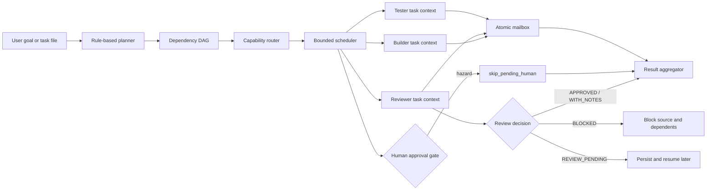

# Multi-Agent Collaboration Architecture

## Scope

The FlowFoundry Multi-Agent MVP coordinates bounded local tasks. It does not
create an unconstrained autonomous conversation loop and it does not make real
provider calls by default. The durable unit is a run manifest plus individually
addressable task state, messages, reviews, approvals, artifacts, and reports.



## Modules and responsibility

| Module | Responsibility |
|---|---|
| `models` | Versionable Agent, Task, Plan, ProviderResult, status, risk, and review vocabulary |
| `registry` | Agent metadata, availability, capability/permission matching, cost preference, fallback, and concurrency limits |
| `planner` | Offline rule-based Builder → Reviewer → Tester plan and explicit JSON plan loading |
| `router` | Deterministic task-to-agent selection |
| `providers` | Fake/dry provider and an explicitly enabled local-command seam; no credential discovery |
| `workspace` | Contained run paths, schema version, 0700 directories, 0600 atomic redacted files, and manifest locking |
| `mailbox` | Locked, ordered, schema-versioned agent messages |
| `approvals` / `policies` | Default human gates for dangerous action classes |
| `scheduler` | Dependency readiness, parallel independent tasks, per-agent concurrency, retry, review transitions, and skip propagation |
| `evaluator` | `APPROVED`, `APPROVED_WITH_NOTES`, `BLOCKED`, and `REVIEW_PENDING` record protocol |
| `recovery` | Interrupted-state repair, explicit retry, and input-hash reconciliation |
| `aggregator` | Completed/unfinished tasks, tests, risks, human actions, generated files, commits, and next step |
| `cli` | Additive `flowfoundry team` interface; existing project/cc/aiproj behavior is unchanged |

## Agent registry

Every agent declares an ID, display name, provider, role, capabilities, command
template, cost class, concurrency limit, permission profile, context-limit
metadata, availability, workspace mode, and enabled flag. The bundled examples
are `codex-builder`, `deepseek-reviewer`, `claude-architect`, and
`local-tester`.

Real agents are unavailable by default. Offline runs create an in-memory
synthetic view of the registry and route the same identities through the fake
provider. This tests routing without implying that a provider account or binary
is configured.

## Planning and scheduling

Task plans are dependency ordered and schema-versioned. Each task includes its
dependencies, role, required/preferred capabilities, inputs, expected outputs,
risk, approval requirements, validation commands, retry bound, timeout metadata,
and optional fallback agent. Explicit plans may include independent tasks; the
scheduler executes ready tasks in parallel while a semaphore enforces each
agent's concurrency limit.

A normal generated plan is:

```text
build (review_required) → review → test → aggregate
```

`REVIEW_PENDING` stops dependents without discarding state. `BLOCKED` blocks the
reviewed source and skips tasks that depend on it. A retry never exceeds the
task's declared limit.

## Durable run layout

```text
.flowfoundry/runs/<run-id>/
├── manifest.json
├── tasks/<task-id>/{task.json,result.json}
├── artifacts/
├── messages/
├── reviews/
├── logs/
├── approvals/
├── final/{report.json,report.md}
└── HUMAN_ACTIONS_REQUIRED.md  # only when a gate is encountered
```

The run root is ignored by Git. Writes use same-directory temporary files,
`fsync`, and atomic replacement. Manifest and mailbox updates are lock-protected.
IDs and all resolved paths are contained below the configured root. Completed
tasks whose input hash has not changed survive resume/reconciliation and are not
executed again.

## Extension boundary

The provider protocol is intentionally small: execute one structured task in an
isolated task directory and return a serializable result. Production adapters
can later add provider-native streaming, process supervision, and worktree
provisioning without changing the task, review, mailbox, or report schemas. Such
adapters must remain opt-in and must not discover credentials implicitly.

