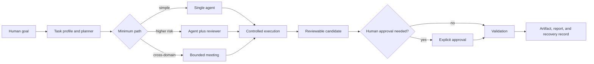

<p align="center">
  
</p>

# FlowFoundry

**AI is moving from individual models to coordinated systems.**

FlowFoundry is a local-first AI coordination layer that helps people manage
models, tools, workflows, permissions, costs, and evidence around real goals.

Local-first · Human-centered · Provider-aware · Open source foundation

> **Alpha / developer preview.** The offline coordination path is runnable and
> tested. Real-provider execution is explicit opt-in and not equally verified
> across every provider. See [Current Status](docs/CURRENT_STATUS.md) before
> depending on FlowFoundry in production.

## Why FlowFoundry?

**Problem:** AI tools are fragmented. People choose models, move context,
reconcile outputs, watch costs, and decide which actions are safe—manually.

**Solution:** FlowFoundry adds a coordination layer around a goal. It plans a
bounded path, routes eligible capabilities, preserves evidence, and stops for
human approval when an action crosses a permission boundary.

| Traditional AI assistant | FlowFoundry |
|---|---|
| User chooses a model and writes a prompt | User defines a goal and constraints |
| One assistant returns an answer | A bounded workflow coordinates suitable models and tools |
| User manually combines outputs and checks effects | Review, evidence, recovery, and approvals are part of the workflow |

ChatGPT, Claude, Copilot, Codex, DeepSeek, and local models are intelligence
resources. FlowFoundry does not replace them; it coordinates eligible resources
around the user's goal.

Specialized models and tools are multiplying faster than people can manage
their context, cost, privacy, and failure modes. **Models are tools.
Intelligence comes from coordination.**

**Start here:** understand it in 10 seconds above, reach the offline workflow in
[30 minutes](#quick-start), or inspect the
[current evidence and limitations](docs/LIMITATIONS.md). The complete external
Alpha path is in the [First External Alpha User Guide](docs/ALPHA_USER_GUIDE.md).

## Product boundary

| Maturity | Product surface | Public claim |
|---|---|---|
| **SHIPPED — Alpha** | AI coordination layer | CLI/terminal planning, routing, offline execution, review, approval, recovery, reports, and Git isolation |
| **DESIGNED — not implemented** | Mobile Command Center | PWA product, interaction, transport, and security specifications only |
| **FUTURE** | Personal AI Assistant / Personal AI OS | Personal context, memory, preferences, and adaptive resource optimization are roadmap work |

There is no shipped mobile app, complete personal-memory layer, or autonomous
AI authority in the current Alpha.

See the [unified product architecture](docs/FLOWFOUNDRY_PRODUCT_ARCHITECTURE.md)
for the current runtime, future personal-context layer, and interface roadmap.

## What is FlowFoundry?

FlowFoundry is a local-first foundation for planning, routing, executing,
reviewing, and recovering bounded AI workflows. It combines a provider-aware
team runtime with project lifecycle management, explicit permissions, durable
run state, Git-isolated writer candidates, human approval gates, and reusable
workflow contracts.

It exists because useful AI work is larger than a prompt. A real task also
needs the right model, the right tools, controlled context, cost and permission
limits, validation, human judgment, and a recovery path when something fails.

FlowFoundry is different from a chatbot or an open-ended autonomous-agent loop:

- it selects a minimum sufficient path instead of always spawning a large team;
- it treats model output as a candidate until trusted code and people validate it;
- it keeps real-provider use explicit and offline execution as the safe default;
- it records unknown token or cost data as unknown instead of inventing estimates;
- it isolates write-capable agents in managed Git worktrees and leaves the main
  working tree untouched;
- it integrates real workflow examples without pretending they share one UI or
  dependency environment.

## What works today

| Status | Capability | Honest boundary |
|---|---|---|
| **Implemented** | Goal profiling and minimum-path planning | Rule-based; chooses single, reviewed, or bounded team execution |
| **Implemented** | Offline multi-agent runs | Fake providers make planning, scheduling, review, retry, resume, and reports reproducible without network calls |
| **Implemented** | Workspace and launcher runtime | Project selection, Claude/DeepSeek/Codex launch profiles, permissions, session records, recovery, and an adaptive terminal UI |
| **Implemented** | Safety-bounded execution | Human approval gates, provider preflight, durable cancellation, partial-result preservation, and Git worktree isolation |
| **Implemented** | Workflow/component contracts | Four cataloged components, two workflow contracts, and thirteen registered capabilities validate locally |
| **Implemented** | Reference workflows | Media-skill contracts, a private MediaFlow boundary, and deterministic nameplate generation |
| **Experimental** | Real-provider orchestration | Codex writer and DeepSeek-compatible reviewer paths have bounded live evidence; provider parity is incomplete |
| **Experimental** | Cost-aware routing and memory | Measured usage and simple performance history exist; there is no complete pricing, quota, or learned optimizer |
| **Planned** | Personal context engine | Long-term preferences, knowledge, and cross-workflow memory are not implemented |
| **Planned** | Broad provider/plugin ecosystem | Gemini, Grok, general local-model adapters, and external plugin loading are future work |

The evidence and limitations behind this table live in
[docs/CURRENT_STATUS.md](docs/CURRENT_STATUS.md).

## Product preview

<p align="center">
  
</p>

The current launcher is content-aware: it adapts to project names, branch names,
visible metadata, CJK display width, and terminal size. The image above is a
rendered product preview based on the current TUI contract; see the
[machine-verified terminal layouts](docs/launcher-layout-examples.md).

The first public demo recording/GIF is still a release-media gate. The committed
SVG demo cards are storyboards, not proof of a finished graphical client. The
reproducible [GitHub Release Assistant](docs/demos/github-release-assistant.md)
and [Personal AI Manager](docs/demos/personal-ai-manager-demo.md) walkthroughs
are the current verified script sources.

## 90-second flagship demo

> **User:** “Prepare my GitHub release.”

The [GitHub Release Assistant](docs/demos/github-release-assistant.md) exercises
the current planner, capability router, offline agent identities, structured
review, durable evidence, and approval gate. It routes planning to Claude
Architect, code-oriented work to Codex Builder, security review to DeepSeek
Reviewer, and the test stage to Local Tester—through deterministic fake
providers, with no network call or model bill.

The demo ends at the human approval boundary. It does not run the project's real
test suite, build distributable artifacts, write release files, push, tag,
deploy, or publish.

## Quick start

**Targets:** validate installation within 10 minutes and complete the first
evidence/approval workflow within 30 minutes.

Requirements: Python 3.11+ and Git. The public commands below become valid only
after the immutable `v0.2.0-alpha.1` tag is published. Invitation-only testers
must instead use the exact candidate SHA and source supplied by the release
owner; never substitute a mutable branch head or the historical runtime
baseline.

### 0–10 minutes — install and validate

```bash
git clone --branch v0.2.0-alpha.1 --single-branch \
  https://github.com/ryanshi1103/ai-workflow-foundry.git flowfoundry
cd flowfoundry

python3 -m venv .venv
. .venv/bin/activate
python3 -m pip install .

# Validate the catalog, contracts, and capability registry.
flowfoundry validate
```

Expected checkpoint:

```text
validated 4 FlowFoundry components
validated 2 workflow contracts
validated 13 registered capabilities
```

### 10–20 minutes — run the flagship offline workflow

```bash
# Preview the five-task plan without creating run state.
flowfoundry team plan \
  examples/personal-ai/github-release-assistant.json

# Run it through deterministic fake providers.
flowfoundry team run \
  examples/personal-ai/github-release-assistant.json \
  --run-id first-alpha-workflow
```

### 20–30 minutes — inspect evidence and the human boundary

```bash
flowfoundry team status first-alpha-workflow
flowfoundry team review first-alpha-workflow
flowfoundry team report first-alpha-workflow
```

Success is `completed_with_blockers`: four tasks finish and `package` stops at
`skipped_pending_human`. That is the intended approval boundary. Do not approve
the task during first-user validation.

The workflow uses deterministic fake providers: it does not inspect the
repository, run its real tests, change files, make a network request, incur a
model bill, push, tag, deploy, or publish. Routing identities are not evidence
that the named cloud providers were called. Run IDs are durable; choose a new ID
when repeating the command.

If any checkpoint differs, use [Alpha Troubleshooting](docs/TROUBLESHOOTING.md)
and report the exact candidate/artifact identity with sanitized output.

To preview the minimum sufficient plan without creating run state:

```bash
printf '%s\n' '{"goal":"Review one README change"}' | \
  flowfoundry team plan /dev/stdin
```

## Architecture



FlowFoundry separates provider selection, permissions, execution, review, and
approval. This keeps coordination explainable and makes failures recoverable.
Read the [architecture guide](docs/ARCHITECTURE.md) for module-level details.

## Flagship demos

These demos are product narratives with explicit maturity labels, not claims
that every step already has a polished UI.

| Demo | User value | Current state | Preview |
|---|---|---|---|
| [GitHub Release Assistant](docs/demos/github-release-assistant.md) | Coordinate planning, code-oriented work, security review, testing stage, evidence, and approval | **Alpha synthetic coordination demo**; no real project tests or release side effects | Verified fixture and CLI lifecycle; recording pending |
| [Personal AI Manager](docs/demos/personal-ai-manager-demo.md) | Turn a goal and constraints into a minimum reviewed path | **Alpha coordination slice**; personal semantic memory is planned | Offline fixtures and script verified; recording pending |
| [AI Project Manager](docs/demos/AI_PROJECT_MANAGER.md) | Coordinate a builder, reviewer, and tester with durable evidence | **Alpha synthetic lifecycle**; fake output is not application quality | [GIF storyboard](docs/assets/demos/ai-project-manager-placeholder.svg) |

## Product examples

| Example | What coordination means | Maturity |
|---|---|---|
| Personal AI Manager | Turn a goal, privacy boundary, budget, and available agents into a minimum reviewed path | Alpha coordination slice |
| AI Project Manager | Coordinate implementation, review, validation, Git isolation, and approval | Alpha synthetic lifecycle |
| Research Assistant | Select sources and specialist capabilities with provenance and review | Planned |
| Learning Assistant | Build a goal-aware learning workflow from user-selected materials and feedback | Concept study |

These examples share coordination contracts; they do not imply one universal
model, unrestricted autonomy, or access to a user's data by default.

The strongest near-term product story is human, not architectural: a developer
asks, “Prepare my GitHub release.” The current demo validates a user-supplied
task graph, routes its planning, code-oriented, review, and test-stage roles,
persists synthetic evidence, and stops before the scoped release approval. It
does not inspect the repository or run real tests. A student learning-and-career
plan is a compelling later vision, but it depends on the planned personal-context
layer and is not presented as a current Alpha demo.

The future phone experience is a **human approval and intelligence interface**,
not remote desktop. It submits goals, reviews plans, shows evidence-backed
progress, and signs exact actions while projects and credentials remain on the
computer. This direction is designed but not implemented; see the
[Mobile AI Command Center](docs/MOBILE_AI_COMMAND_CENTER.md).

## Repository components

| Layer | Component | Maturity |
|---|---|---|
| Coordination runtime | `src/flowfoundry/orchestration/` | Alpha |
| Project runtime | [AI Workspace Manager](core/workspace-manager/README.md) | Beta |
| Media workflow pack | [Confera Media Skills](components/confera-media-skills/README.md) | Beta |
| Private media boundary | [Huiying / MediaFlow](applications/mediaflow/README.md) | Contract only; implementation excluded |
| Document automation | [Print-ready Nameplate Generator](workflows/print-ready-nameplate-generator/README.md) | Stable focused workflow |

The monorepo is the integration point. Components keep separate boundaries when
their users, dependencies, licenses, data, or release processes differ.

## Safety model

- Local and fake-provider execution is the default.
- Network and real-provider use require explicit operator intent.
- Provider readiness and workspace compatibility are separate preflight gates.
- AI output is untrusted until schema checks, review, validation, and any
  required human approval complete.
- Write-capable tasks use FlowFoundry-owned Git worktrees with immutable base
  commits and exclusive writer leases.
- Destructive actions, candidate merge, push, PR creation, and publication are
  outside the automatic runtime today.

See the [security model](MULTI_AGENT_SECURITY_MODEL.md) and
[operator guide](MULTI_AGENT_OPERATOR_GUIDE.md).

## Roadmap

The long-term direction is a personal AI manager that coordinates models,
tools, knowledge, privacy, cost, time, and human feedback. It is a staged
engineering direction—not a claim of autonomous general intelligence.

1. **Foundation** — local runtime, contracts, recovery, and safety boundaries.
2. **Multi-agent orchestration** — minimum-path teams, review, budgets, and
   provider adapters.
3. **Personal context engine** — consent-based preferences, knowledge, and
   portable memory.
4. **Adaptive AI manager** — evidence-based model and workflow selection.
5. **Personal AI OS** — an open coordination substrate across tools
   and devices, with the human retaining authority.

Read the canonical [three-stage product roadmap](docs/PRODUCT_ROADMAP.md). The Personal AI
Assistant and Personal AI OS stages are future direction, not Alpha claims.

## Contributing

FlowFoundry needs contributors interested in orchestration, provider adapters,
workflow contracts, privacy, developer experience, testing, and human-centered
AI infrastructure.

Start with [CONTRIBUTING.md](CONTRIBUTING.md), then choose a scoped issue or
open a design discussion before a large architectural change. New capabilities
should include a clear trust boundary, offline tests, failure behavior, and an
honest maturity label.

The launch backlog contains exactly
[five reviewed good-first-issue proposals](docs/GOOD_FIRST_ISSUES.md). They are
not considered open community work until a maintainer verifies them against the
final candidate and publishes them.

Useful contributor commands:

```bash
PYTHONPATH=src python3 -m flowfoundry validate
PYTHONPATH=src python3 -m unittest discover -s tests -v
python3 -m unittest discover -s components/confera-media-skills/tests -v
python3 -m unittest discover -s workflows/print-ready-nameplate-generator/tests -v
```

## Documentation

- [Authoritative document index](docs/AUTHORITATIVE_DOCUMENT_INDEX.md)
- [Current status](docs/CURRENT_STATUS.md)
- [Product architecture](docs/FLOWFOUNDRY_PRODUCT_ARCHITECTURE.md)
- [Product roadmap](docs/PRODUCT_ROADMAP.md)
- [Alpha release checklist](docs/ALPHA_RELEASE_CHECKLIST.md)
- [First external Alpha user guide](docs/ALPHA_USER_GUIDE.md)
- [Known limitations](docs/LIMITATIONS.md)
- [GitHub Release Assistant demo](docs/demos/github-release-assistant.md)
- [Contribution guide](CONTRIBUTING.md)
- [Security policy](SECURITY.md)

## Release and license status

This candidate uses a new-root, allowlist-only history and must not be confused
with the preserved migration history. Feedback Intelligence is excluded because
its publication license is unresolved. No push, merge, tag, or release has been
performed. See the [sanitization report](docs/SANITIZATION_REPORT.md),
[license decision](docs/LICENSE_DECISION.md), and
[final release report](FINAL_RELEASE_REPORT.md).

The repository root package is MIT licensed. Included components retain their
own license files and documented boundaries.
