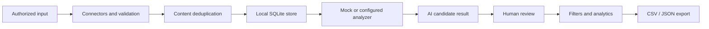

<p align="center">
  
</p>

# Feedback Intelligence System

A local-first application for turning authorized feedback data into reviewable,
auditable intelligence. It imports CSV, JSON, sample, or explicitly configured
Apify data; removes duplicates; produces AI-assisted candidate classifications;
keeps human corrections separate from model output; and exports stable CSV or
JSON records.

This repository evolves the public `feedback-analysis-system` product lineage.
The canonical code identity is now `feedback-intelligence-system`; remote rename
and release operations are intentionally outside this migration.

## Why it exists

Feedback workflows need more than sentiment labels. Operators need to understand
what requires action, review uncertain model output, preserve the original
evidence, and export results without surrendering control of the local dataset.
The application demonstrates that complete loop without requiring a hosted data
platform.

## Features

- Feedback type, sentiment, category, severity, evidence, and action analysis
- SHA-256 content deduplication across supported imports
- Explicit human review with an audit record that does not overwrite AI output
- Local SQLite storage and mock analysis mode for an offline demonstration
- Retry, timeout, concurrency, and result-cache controls for configured providers
- Stable UTF-8-SIG CSV and JSON export formats
- Streamlit overview, import, analysis, filtering, review, and settings pages
- Additive FlowFoundry application contract with no core-runtime dependency

The application does not bypass logins, captchas, paywalls, access controls, or
private accounts. It does not include covert collection, credential extraction,
or multi-user production deployment.

## Architecture



The canonical Python package is `feedback_intelligence`:

```text
feedback_intelligence/
├── adapters/          # dependency-light FlowFoundry contract
├── connectors/        # CSV, JSON, sample, and configured Apify input
├── migrations/        # stable schema migration API
├── prompts/           # versioned analysis prompts
├── repositories/      # query, filter, and review persistence
└── services/          # import, dedupe, analysis, provider, and export logic
```

`pages/` remains the Streamlit presentation layer. `src.*` remains a deprecated
compatibility namespace and resolves to the same canonical module objects.

## Installation

Python 3.11 or newer is required.

```bash
python3 -m venv .venv
source .venv/bin/activate
python -m pip install -e ".[dev]"
cp .env.example .env
```

The setup helper performs the equivalent project-local installation:

```bash
./scripts/setup.sh
```

## Demo

No API credential is required for the deterministic mock workflow.

```bash
export APP_MOCK_MODE=true
./scripts/run.sh
```

Open `http://127.0.0.1:8501`, import the synthetic sample dataset, run analysis,
review a result, and export it. A real screenshot is pending; the commands above
are the reproducible demo source and no generated screenshot is presented as a
product capture.

For an explicitly enabled provider, configure `DEEPSEEK_API_KEY` and set
`APP_MOCK_MODE=false`. Apify access is also opt-in through `APIFY_TOKEN` and
`APIFY_ACTOR_ID`.

## Configuration

Existing environment variables remain supported:

- `APP_DB_URL` (legacy database URL; default `sqlite:///data/social_monitor.db`)
- `APP_MOCK_MODE`, `APP_LOG_LEVEL`, `APP_PORT`
- `DEEPSEEK_API_KEY`, `DEEPSEEK_BASE_URL`, `DEEPSEEK_MODEL`
- `DEEPSEEK_MAX_CONCURRENCY`, `DEEPSEEK_TIMEOUT_SECONDS`, `DEEPSEEK_BATCH_SIZE`
- `APIFY_TOKEN`, `APIFY_ACTOR_ID`, `APIFY_MAX_ITEMS`

`FEEDBACK_DB_URL` is the canonical additive database variable and takes
precedence when both names are present. Relative SQLite paths are anchored to the
application root so launching from another working directory cannot silently
create a different empty database.

## Tests

```bash
./scripts/test.sh

# or
pytest -q
ruff check feedback_intelligence src tests app.py pages
```

Compatibility tests cover empty and legacy database upgrades, repeated
migrations, preserved rows, the real in-memory database URL, legacy imports,
environment variables, export format, deduplication, filters, and Streamlit
component IDs.

## Data privacy

- Inputs must be public, user-provided, or obtained through an authorized API.
- SQLite databases, WAL/SHM files, exports, caches, logs, `.env`, and credentials
  are ignored by Git.
- API keys are read from environment variables and are not written to source.
- The default listener is local (`127.0.0.1`).
- Human corrections are stored separately from original AI results.
- Migrations are additive and never delete or rewrite existing feedback rows.

## Migration compatibility

The migration is intentionally additive:

- `app.py`, all existing scripts, and existing Streamlit component IDs remain.
- `src.*` imports alias `feedback_intelligence.*` during the deprecation window.
- The old `APP_DB_URL` and `data/social_monitor.db` default remain supported.
- Database schema upgrades are idempotent and safe to repeat.
- Existing export column order, UTF-8-SIG CSV encoding, and JSON shape remain.
- No GitHub repository rename, force push, database move, or user-data copy occurs.

See [docs/MIGRATION_COMPATIBILITY.md](docs/MIGRATION_COMPATIBILITY.md) for the
operator checklist.

## FlowFoundry relationship

The application publishes a dependency-light contract from
`feedback_intelligence.adapters.flowfoundry`. FlowFoundry can register its
workflow and capabilities while this business application remains independently
testable. Provider access, workspace lifecycle, finalization, and redaction are
policy boundaries rather than hidden imports into the application internals.

## Roadmap

- Complete the local repository identity transition after manual approval
- Add more authorized source adapters behind the existing connector boundary
- Expand migration fixtures as future schema versions are introduced
- Add reproducible, real product screenshots when the demo is captured
- Integrate versioned FlowFoundry workflow execution without coupling domain code

## Usage terms

This project is currently provided for learning and internal use. No open-source
license is asserted by the migration. Usage of DeepSeek and Apify remains subject
to their respective terms.
