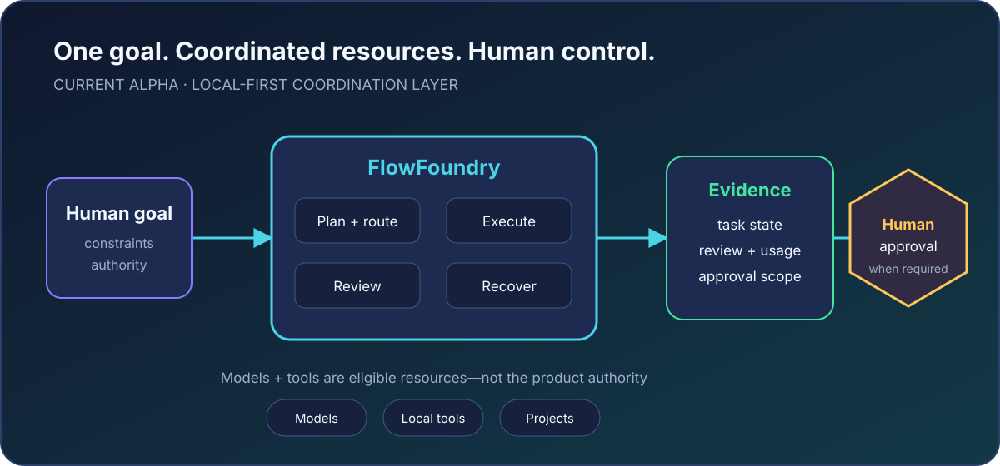
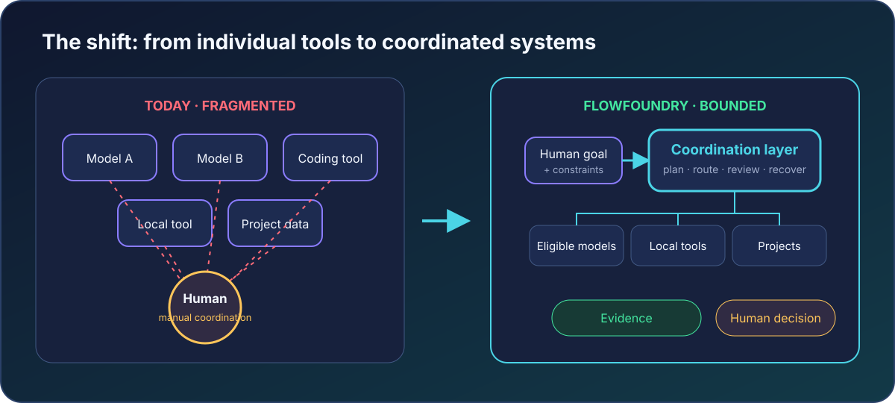
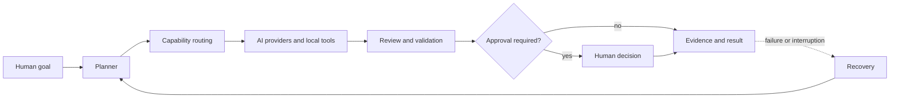
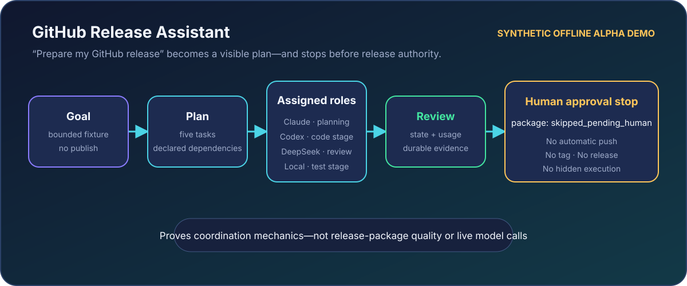
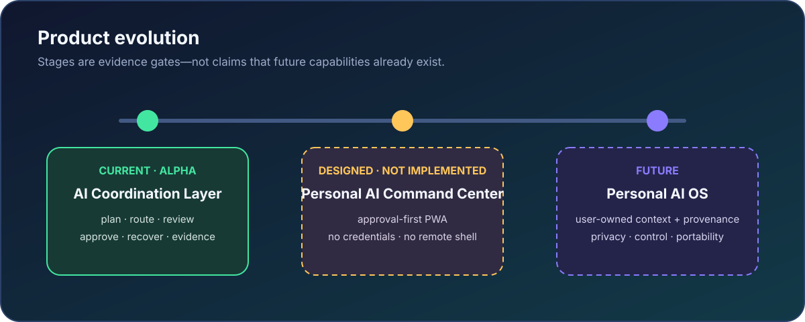

<p align="center">
  
</p>

<h1 align="center">FlowFoundry</h1>

<p align="center"><strong>One goal. The smallest sufficient AI team.</strong></p>

<p align="center">
  <strong>Local-first Adaptive AI Team Runtime.</strong><br>
  The current Alpha is a coordination layer that profiles each goal, chooses
  the minimum sufficient path, and preserves permissions, evidence, and human authority.
</p>

<p align="center"><code>Goal → Profile → Minimum Sufficient Team → Execute → Validate</code></p>

<p align="center">
  <sub>local-first · adaptive team sizing · bounded meetings · execution · validation · recovery</sub>
</p>

<p align="center">
  <a href="#quick-start">Try the offline workflow</a> ·
  <a href="#flagship-demo">See the flagship demo</a> ·
  <a href="#contributing">Contribute</a> ·
  <a href="docs/CURRENT_STATUS.md">Check current status</a>
</p>

<p align="center">
  
</p>

> **Alpha / developer preview.** The deterministic offline coordination path
> is runnable and tested. Public artifacts, external install evidence, and the
> final demo recording are still release gates. Real-provider execution is
> explicit opt-in and provider parity is incomplete. Read the
> [current status](docs/CURRENT_STATUS.md) and
> [limitations](docs/LIMITATIONS.md) before relying on FlowFoundry.

## Why now?

**AI is moving from individual models to coordinated systems.**

AI tools are multiplying. A useful project may involve a coding model, a
reviewer, local tools, project files, security checks, and a human decision.
Each tool can be capable while the overall workflow remains fragmented.

The problem is no longer only intelligence. It is coordination:

- context gets copied between tools;
- permissions and side effects are easy to lose track of;
- cost and usage evidence is incomplete;
- review happens separately from execution;
- failures leave partial work that is hard to recover; and
- the human approval boundary is often implicit.

<p align="center">
  
</p>

FlowFoundry does not compete with AI models. It coordinates eligible models,
tools, workflows, permissions, costs, evidence, approvals, and recovery around
a goal. **Use the minimum sufficient path—not the largest possible AI team.**

## What exists today

| Maturity | Product surface | Honest boundary |
|---|---|---|
| **SHIPPED — Alpha** | Planning, capability routing, deterministic offline execution, review, approval gates, recovery, reports, provider preflight, and Git isolation | CLI/terminal product; real-provider compatibility and cost completeness remain experimental |
| **DESIGNED — not implemented** | Personal AI Command Center | Approval-first mobile/PWA specifications only; no shipped mobile application |
| **FUTURE** | Personal AI OS | Consent-based context, preferences, provenance-aware memory, and adaptive resource optimization are not shipped |

There is no autonomous publishing authority, complete personal-memory layer,
or universal intelligence claim in the Alpha.

## How FlowFoundry works



The profiler first asks whether one Agent is sufficient. It adds independent
review when risk requires it and uses a bounded team only when complementary
views matter. A Meeting starts from one Context Pack, gathers independent
Round 1 views, stops early when they converge, or opens targeted Round 2 only
for detected conflicts; unresolved dissent remains in the result.

Routing then filters by capability, readiness, permission, workspace
compatibility, and policy. Outputs remain candidates until review and
validation complete. Consequential actions stop at a scoped human approval
gate, while durable run state preserves evidence and recovery.

Read the [product architecture](docs/FLOWFOUNDRY_PRODUCT_ARCHITECTURE.md) or
the [module-level architecture](docs/ARCHITECTURE.md).

## Why is it different?

The comparison is about operating style, not a claim that other assistants or
agent frameworks cannot coordinate work.

| Concern | Traditional assistant interaction | FlowFoundry coordination workflow |
|---|---|---|
| Starting point | Choose a model and prompt it | Define a goal, constraints, and authority |
| Coordination | The user carries context between interactions | A bounded plan records roles, dependencies, and state |
| Permissions | Often managed outside the conversation | Declared tool and workspace permissions are part of execution |
| Evidence | The answer or transcript is the main record | Tasks, reviews, usage, approvals, and reports remain inspectable |
| Recovery | The user reconstructs interrupted work | Retry, resume, cancellation, and partial results are durable states |
| Cost awareness | Checked separately or after the call | Provider-reported usage/cost is recorded; unknown remains unknown |
| Human control | Depends on the surrounding product/workflow | Review and approval are separate, explicit decisions |

ChatGPT, Claude, Copilot, Codex, DeepSeek, and local models can be intelligence
resources. FlowFoundry is the local coordination and project-control boundary
around eligible resources; it does not replace them.

## Flagship demo

> **Goal:** “Prepare my GitHub release.”

<p align="center">
  
</p>

The [GitHub Release Assistant](docs/demos/github-release-assistant.md) turns an
explicit five-task fixture into a visible coordination lifecycle:

1. validate the declared release context and plan;
2. route planning, code-oriented, security-review, and test-stage roles;
3. execute through deterministic fake providers;
4. preserve task state, review, usage, and evidence; and
5. stop the release-package task at `skipped_pending_human`.

The current demo makes no cloud-provider call, does not inspect the repository,
does not run the project's real tests, and does not write, push, tag, deploy, or
publish. Its value is showing coordination and the human boundary—not pretending
that a synthetic run created a real release.

## Quick start

**Target:** reach the first deterministic result in under 10 minutes from an
approved source checkout. The external artifact-install target remains
unverified until the release build and clean-install gates pass.

Requirements: Python 3.11+ and Git.

```bash
python3 -m venv .venv
. .venv/bin/activate
python3 -m pip install .

# Verify the bundled catalog, contracts, and capabilities.
flowfoundry validate

# Preview and run the offline flagship workflow.
flowfoundry team plan examples/personal-ai/github-release-assistant.json
flowfoundry team run \
  examples/personal-ai/github-release-assistant.json \
  --run-id first-flowfoundry-run

# Inspect the evidence and approval boundary.
flowfoundry team report first-flowfoundry-run
```

Expected validation checkpoint:

```text
validated 4 FlowFoundry components
validated 36 project decisions
validated 2 workflow contracts
validated 13 registered capabilities
```

Expected workflow state: `completed_with_blockers`, with four tasks complete
and `package` stopped at `skipped_pending_human`. That is a successful safety
outcome. Do not approve it during the first walkthrough.

If installation or output differs, use the
[installation guide](docs/INSTALLATION.md),
[troubleshooting guide](docs/TROUBLESHOOTING.md), and
[Alpha user guide](docs/ALPHA_USER_GUIDE.md). Do not add provider credentials
to evaluate the offline path.

## Architecture

FlowFoundry keeps models replaceable and separates four concerns:

- **Runtime:** provider identities and deterministic/local capabilities;
- **Coordination:** planning, routing, bounded execution, review, approval, and recovery;
- **Personal context:** a future, consent-based layer—not a shipped memory system; and
- **Interfaces:** CLI/terminal today, with an approval-first mobile concept designed for later.

Security, privacy, cost, provenance, evidence, and human authority remain
cross-cutting controls. See the
[authoritative document map](docs/AUTHORITATIVE_DOCUMENT_MAP.md) for the
official product, architecture, roadmap, security, and release sources.

## Roadmap

<p align="center">
  
</p>

1. **Current — AI Coordination Layer:** make planning, routing, review,
   approval, recovery, and evidence trustworthy for external Alpha users.
2. **Next — Personal AI Command Center:** validate an approval-first mobile PWA
   boundary without storing credentials or exposing an unrestricted shell.
3. **Future — Personal AI OS:** explore user-owned context, provenance,
   preferences, and resource optimization with privacy and human authority.

Stages are evidence gates, not calendar promises. Read the canonical
[product roadmap](docs/PRODUCT_ROADMAP.md).

## Contributing

FlowFoundry is especially useful for contributors interested in local-first AI
infrastructure, orchestration, safety boundaries, developer experience, testing,
and technical communication.

- **Developers:** improve CLI clarity, workflow fixtures, isolation, and tests.
- **Students:** improve tutorials, examples, and first-install feedback.
- **Researchers:** help define evaluation, provenance, and reproducible evidence.
- **AI builders:** strengthen provider diagnostics without widening authority.

Start with [CONTRIBUTING.md](CONTRIBUTING.md), follow the
[Day 1 → Day 7 journey](docs/CONTRIBUTOR_JOURNEY.md), or review the
[five scoped starter issues](docs/GOOD_FIRST_ISSUES.md). Small, evidenced
changes are preferred over broad capability claims.

## Trust and project status

- [Current capabilities and evidence](docs/CURRENT_STATUS.md)
- [Known Alpha limitations](docs/LIMITATIONS.md)
- [Historical decision ledger](docs/DECISION_LEDGER.md)
- [Security policy](SECURITY.md)
- [Documentation map](DOCUMENTATION_MAP.md)
- [Final candidate and release gates](docs/FINAL_CANDIDATE_CHECKLIST.md)
- [Community operating model](docs/COMMUNITY_OPERATING_MODEL.md)

FlowFoundry is MIT licensed. No push, tag, release, mobile product, personal
memory system, or automatic publication capability is implied by this
documentation branch.
