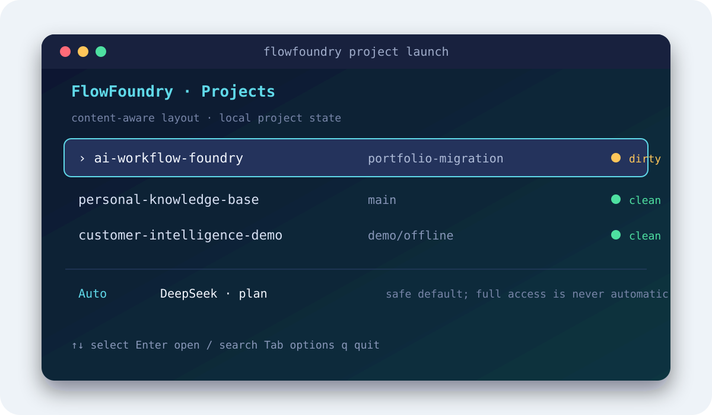
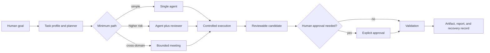

<p align="center">
  
</p>

<h1 align="center">FlowFoundry</h1>
<p align="center"><strong>AI Coordination Layer for Personal AI Systems</strong></p>
<p align="center">Local-first · Human-centered · Provider-aware · Open source foundation</p>

> **Alpha / developer preview.** The offline coordination path is runnable and
> tested. Real-provider execution is explicit opt-in and not equally verified
> across every provider. See [Current Status](docs/CURRENT_STATUS.md) before
> depending on FlowFoundry in production.

Most AI products connect a user to one model:

```text
User  ───────────────>  One AI Model
```

FlowFoundry is building a coordination layer between a human goal and the AI
capabilities that can help accomplish it:

```text
                         Human Goal
                              │
                              ▼
                      AI Coordinator
                              │
                              ▼
             ┌────────┬──────────┬────────┬─────────┐
             │ Claude │ DeepSeek │ Codex  │  Local  │
             └────────┴──────────┴────────┴─────────┘
                              │
                              ▼
                  Reviewable Best Solution
```

**Models are tools. Intelligence comes from coordination.**

## What is FlowFoundry?

FlowFoundry is a local-first foundation for planning, routing, executing,
reviewing, and recovering bounded AI workflows. It combines a provider-aware
team runtime with project lifecycle management, explicit permissions, durable
run state, Git-isolated writer candidates, human approval gates, and reusable
workflow contracts.

It exists because useful AI work is larger than a prompt. A real task also
needs the right model, the right tools, controlled context, cost and permission
limits, validation, human judgment, and a recovery path when something fails.

FlowFoundry is different from a chatbot or an open-ended autonomous-agent loop:

- it selects a minimum sufficient path instead of always spawning a large team;
- it treats model output as a candidate until trusted code and people validate it;
- it keeps real-provider use explicit and offline execution as the safe default;
- it records unknown token or cost data as unknown instead of inventing estimates;
- it isolates write-capable agents in managed Git worktrees and leaves the main
  working tree untouched;
- it integrates real workflow examples without pretending they share one UI or
  dependency environment.

## What works today

| Status | Capability | Honest boundary |
|---|---|---|
| **Implemented** | Goal profiling and minimum-path planning | Rule-based; chooses single, reviewed, or bounded team execution |
| **Implemented** | Offline multi-agent runs | Fake providers make planning, scheduling, review, retry, resume, and reports reproducible without network calls |
| **Implemented** | Workspace and launcher runtime | Project selection, Claude/DeepSeek/Codex launch profiles, permissions, session records, recovery, and an adaptive terminal UI |
| **Implemented** | Safety-bounded execution | Human approval gates, provider preflight, durable cancellation, partial-result preservation, and Git worktree isolation |
| **Implemented** | Workflow/component contracts | Four cataloged components, two workflow contracts, and thirteen registered capabilities validate locally |
| **Implemented** | Reference workflows | Media-skill contracts, a private MediaFlow boundary, and deterministic nameplate generation |
| **Experimental** | Real-provider orchestration | Codex writer and DeepSeek-compatible reviewer paths have bounded live evidence; provider parity is incomplete |
| **Experimental** | Cost-aware routing and memory | Measured usage and simple performance history exist; there is no complete pricing, quota, or learned optimizer |
| **Planned** | Personal context engine | Long-term preferences, knowledge, and cross-workflow memory are not implemented |
| **Planned** | Broad provider/plugin ecosystem | Gemini, Grok, general local-model adapters, and external plugin loading are future work |

The evidence and limitations behind this table live in
[docs/CURRENT_STATUS.md](docs/CURRENT_STATUS.md).

## Product preview

<p align="center">
  
</p>

The current launcher is content-aware: it adapts to project names, branch names,
visible metadata, CJK display width, and terminal size. The image above is a
rendered product preview based on the current TUI contract; see the
[machine-verified terminal layouts](docs/launcher-layout-examples.md).

## Quick start

Requirements: Python 3.11+ and Git. Until the public launch gates close, start
from an owner-approved local checkout; the final release will replace this note
with the exact sanitized clone URL.

```bash
cd ai-workflow-foundry

python3 -m venv .venv
. .venv/bin/activate
python3 -m pip install -e .

# Validate the catalog, contracts, and capability registry.
flowfoundry validate

# Preview the bundled components and available providers.
flowfoundry list
flowfoundry team providers

# Run an entirely offline coordination example.
flowfoundry team run \
  examples/orchestration/codex-builder-deepseek-reviewer.json
```

The example uses deterministic fake providers by default: it does not make a
network request or billed model call. Real provider execution requires both a
configured local runtime and the explicit `--enable-real-provider` flag.

To preview the minimum sufficient plan without creating run state:

```bash
printf '%s\n' '{"goal":"Review one README change"}' | \
  flowfoundry team plan /dev/stdin
```

## How coordination works



FlowFoundry separates provider selection, permissions, execution, review, and
approval. This keeps coordination explainable and makes failures recoverable.
Read the [architecture guide](docs/ARCHITECTURE.md) for module-level details.

## Flagship demos

These demos are product narratives with explicit maturity labels, not claims
that every step already has a polished UI.

| Demo | User value | Current state | Preview |
|---|---|---|---|
| [Personal AI Manager](docs/demos/personal-ai-manager-demo.md) | Turn a goal and constraints into a minimum reviewed path | **Alpha coordination slice**; personal semantic memory is planned | Verified 90-second offline walkthrough |
| [AI Project Manager](docs/demos/AI_PROJECT_MANAGER.md) | Coordinate a builder, reviewer, and tester with durable evidence | **Alpha synthetic lifecycle**; fake output is not application quality | [GIF storyboard](docs/assets/demos/ai-project-manager-placeholder.svg) |

## Repository components

| Layer | Component | Maturity |
|---|---|---|
| Coordination runtime | `src/flowfoundry/orchestration/` | Alpha |
| Project runtime | [AI Workspace Manager](core/workspace-manager/README.md) | Beta |
| Media workflow pack | [Confera Media Skills](components/confera-media-skills/README.md) | Beta |
| Private media boundary | [Huiying / MediaFlow](applications/mediaflow/README.md) | Contract only; implementation excluded |
| Document automation | [Print-ready Nameplate Generator](workflows/print-ready-nameplate-generator/README.md) | Stable focused workflow |

The monorepo is the integration point. Components keep separate boundaries when
their users, dependencies, licenses, data, or release processes differ.

## Safety model

- Local and fake-provider execution is the default.
- Network and real-provider use require explicit operator intent.
- Provider readiness and workspace compatibility are separate preflight gates.
- AI output is untrusted until schema checks, review, validation, and any
  required human approval complete.
- Write-capable tasks use FlowFoundry-owned Git worktrees with immutable base
  commits and exclusive writer leases.
- Destructive actions, candidate merge, push, PR creation, and publication are
  outside the automatic runtime today.

See the [security model](MULTI_AGENT_SECURITY_MODEL.md) and
[operator guide](MULTI_AGENT_OPERATOR_GUIDE.md).

## Roadmap

The long-term direction is a personal AI manager that coordinates models,
tools, knowledge, privacy, cost, time, and human feedback. It is a staged
engineering direction—not a claim of autonomous general intelligence.

1. **Foundation** — local runtime, contracts, recovery, and safety boundaries.
2. **Multi-agent orchestration** — minimum-path teams, review, budgets, and
   provider adapters.
3. **Personal context engine** — consent-based preferences, knowledge, and
   portable memory.
4. **Adaptive AI manager** — evidence-based model and workflow selection.
5. **Personal Intelligence OS** — an open coordination substrate across tools
   and devices, with the human retaining authority.

Read the full [roadmap](docs/ROADMAP.md) and
[Personal AI Manager direction](docs/PERSONAL_AI_MANAGER.md).

## Contributing

FlowFoundry needs contributors interested in orchestration, provider adapters,
workflow contracts, privacy, developer experience, testing, and human-centered
AI infrastructure.

Start with [CONTRIBUTING.md](CONTRIBUTING.md), then choose a scoped issue or
open a design discussion before a large architectural change. New capabilities
should include a clear trust boundary, offline tests, failure behavior, and an
honest maturity label.

Useful contributor commands:

```bash
PYTHONPATH=src python3 -m flowfoundry validate
PYTHONPATH=src python3 -m unittest discover -s tests -v
python3 -m unittest discover -s components/confera-media-skills/tests -v
python3 -m unittest discover -s workflows/print-ready-nameplate-generator/tests -v
```

## Documentation

- [Current maturity and limitations](docs/CURRENT_STATUS.md)
- [Sanitization report](docs/SANITIZATION_REPORT.md)
- [License decision](docs/LICENSE_DECISION.md)
- [Installation experience](docs/INSTALLATION.md)
- [Vision](docs/VISION.md)
- [Architecture](docs/ARCHITECTURE.md)
- [Personal AI Manager](docs/PERSONAL_AI_MANAGER.md)
- [Roadmap](docs/ROADMAP.md)
- [Demo index](docs/demos/README.md)
- [Visual design system](docs/VISUAL_DESIGN.md)
- [Open-source launch plan](docs/OPEN_SOURCE_LAUNCH.md)
- [Public release phases](docs/PUBLIC_RELEASE_PLAN.md)
- [Marketing plan](docs/MARKETING_PLAN.md)
- [Repository organization proposal](docs/REPOSITORY_STRUCTURE.md)

## Release and license status

This candidate uses a new-root, allowlist-only history and must not be confused
with the preserved migration history. Feedback Intelligence is excluded because
its publication license is unresolved. No push, merge, tag, or release has been
performed. See the [sanitization report](docs/SANITIZATION_REPORT.md),
[license decision](docs/LICENSE_DECISION.md), and
[final release report](FINAL_RELEASE_REPORT.md).

The repository root package is MIT licensed. Included components retain their
own license files and documented boundaries.
