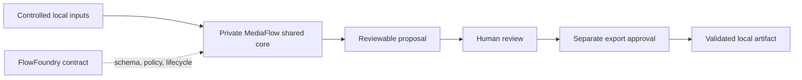

# Huiying / MediaFlow integration contract

MediaFlow is a private, local-first media product. FlowFoundry does not bundle
its commercial implementation. This directory contains only the sanitized
application boundary needed to explain and validate how the product participates
in a FlowFoundry workflow.

## Architecture boundary



The private product retains one shared core for file discovery, media pipeline
execution, task state, naming/output rules, safe path handling, configuration,
and errors. Linux/Web, Windows Desktop, Android companion, and release packaging
remain platform boundaries rather than copies of that core.

## Public contents

- a portable workflow contract;
- a dependency-light Python adapter interface;
- an example configuration containing synthetic paths only;
- architecture and privacy documentation;
- references to the already-public Confera Media Skills capability layer.

## Excluded contents

This integration never contains customer or real media, commercial strategy,
seller or supplier records, production configuration, credentials, signing
material, private packaging keys, real personnel, or the private product source.
Windows builds, dependency locks, signing, installation, real-device tests,
release creation, deployment, and repository push remain explicit human actions.

## Synthetic example

`examples/synthetic-job.json` demonstrates the boundary without shipping a
media fixture or asserting that a product render occurred. All referenced paths
are relative to an operator-controlled root and are validated before use.

## Verification

```bash
PYTHONPATH=src python3 -m flowfoundry validate
PYTHONPATH=src python3 -m unittest tests.test_mediaflow_application -v
```
