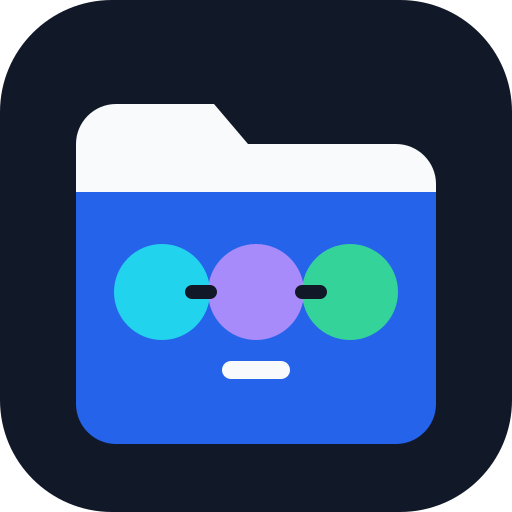

<p align="center">
  
</p>

# AI Workspace Manager

A local-first launcher and project maintenance system for Claude, DeepSeek, and
OpenAI Codex. It keeps one real project root across tools, provides explicit
permission modes, records recoverable AI sessions, and performs cautious
maintenance of a `~/Projects` workspace.

中文说明：这是一个统一管理 AI 编程项目的本地工具。它让 Claude、DeepSeek 和
Codex 使用同一个真实项目目录，提供清晰的权限选择、会话恢复、自动命名、项目
盘点和定期维护，并把危险操作限制在明确的项目根目录内。

## FlowFoundry AI relationship

This repository is the bundled core runtime of
[FlowFoundry AI](https://github.com/ryanshi1103/ai-workflow-foundry). It remains
independently installable and versioned; FlowFoundry adds a broader component
catalog and workflow architecture around its project, permission, and recovery
foundation.

## Components

- `cc`: interactive project/tool/permission launcher.
- `aiproj`: project creation, selection, session tracking, finalization and recovery.
- `cc-projects-maintain`: quick/deep workspace inspection, indexing, duplicate
  review and retention-aware quarantine maintenance.
- `flowfoundry.workspace`: canonical Python runtime for lifecycle, providers,
  hooks, redaction, transcripts, recovery, auto-naming and safe filesystem
  operations. Legacy flat imports and command names remain compatible.
- systemd user timers and Codex profile templates for repeatable deployment.

## Safety properties

- `CC_ACTIVE_PROJECT` is the authoritative project root.
- No automatic timestamp project directories are created by the launcher.
- Full-access modes require an explicit second confirmation.
- Maintenance is scoped to `PROJECTS_ROOT` and supports dry-run operation.
- Original files and uncommitted work are protected from automatic deletion.
- Session exports redact common API keys, bearer tokens, passwords and private keys.
- Deployment backs up managed user files and emits rollback material first.
- Authentication files and API keys are never included in this repository.

## Try it safely

Run the tests before deployment:

```bash
./tests/test-cc.sh
./tests/test-cc-eof-fix.sh
./tests/test-deploy-profile-preservation.sh
PYTHONPATH=src python3 -m unittest discover -s tests -p 'test_*.py' -v
```

Inspect `scripts/deploy.sh`, then deploy to the current user account:

```bash
bash scripts/deploy.sh
```

Start with a maintenance report or dry run:

```bash
cc-projects-maintain --report
cc-projects-maintain --dry-run --quick
```

The maintenance configuration example intentionally uses
`/home/your-user/Projects`; replace it with your real project root.

## Project layout

```text
core/workspace-manager/bin/       compatibility command entry points
src/flowfoundry/workspace/cli/    interactive and project CLI logic
src/flowfoundry/workspace/providers/ portable provider/profile policy
src/flowfoundry/workspace/lifecycle/ project, Git, naming, launch lifecycle
src/flowfoundry/workspace/sessions/ hooks, transcripts, recovery, finalization
src/flowfoundry/workspace/policy/  redaction and local-state boundaries
src/flowfoundry/workspace/maintenance/ inventory and retention operations
core/workspace-manager/config/    portable profiles and systemd examples
core/workspace-manager/scripts/   backup-first deployment
core/workspace-manager/tests/     shell and Python regressions
```

## Scope of this public snapshot

The private operational repository also contains machine-specific mobile SSH,
network, deployment-state and portfolio notes. They are deliberately excluded
here. This public snapshot contains the portable implementation and tests only.

## License

MIT.
