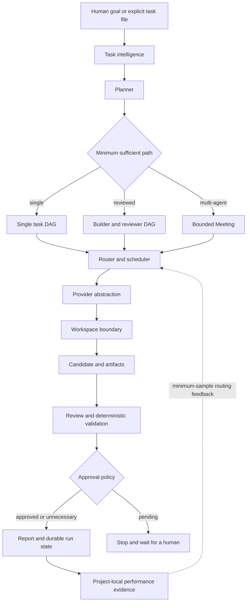
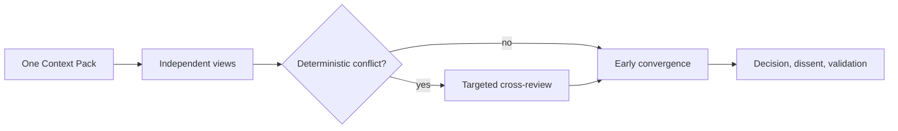

# Architecture

FlowFoundry is a local-first coordination runtime and component contract. It
turns a human goal into a bounded plan, selects eligible capabilities, executes
through provider or deterministic adapters, preserves candidate evidence, and
routes the result through review, validation, approval, and recovery.

This document describes the current architecture. Future personal context and
adaptive management layers are described separately in
[PERSONAL_AI_MANAGER.md](PERSONAL_AI_MANAGER.md).

## System view



## Architectural principles

- **Capabilities before provider names:** tasks request capabilities and
  permissions; provider identity is an adapter and routing concern.
- **Minimum sufficient path:** the task profile determines whether one agent, a
  reviewer, or a bounded team is justified.
- **Trusted code owns effects:** model text cannot directly widen permissions,
  construct arbitrary commands, access secrets, or approve its own side effects.
- **Offline-safe default:** fake providers exercise the lifecycle without a
  network or billed call; real provider execution requires explicit opt-in.
- **Durable state:** plans, attempts, messages, reviews, approvals, artifacts,
  execution handles, and reports survive interruption.
- **Candidates, not silent mutation:** real writers operate in managed Git
  worktrees, and validation runs against the exact candidate.

## Agent architecture

An `AgentSpec` is registry metadata, not a permanently running autonomous
process. It declares:

- identity, role preference, provider, model, and runtime profile;
- capabilities and exposed tool hints;
- required permission compatibility and workspace mode;
- readiness, authentication, privacy, locality, and availability metadata;
- concurrency, cost class, context limit, and optional reliability evidence.

The default registry currently models Codex Builder, DeepSeek Reviewer, Claude
Architect, and Local Tester identities. Offline runs use synthetic readiness
and a fake provider; this verifies orchestration behavior without implying that
the named cloud providers were called.

## Provider abstraction

Provider adapters translate a trusted task envelope into a concrete runtime:

```text
Task + bounded context + schema + tool policy
                    │
                    ▼
             Provider adapter
                    │
          ┌─────────┼──────────┐
          ▼         ▼          ▼
       Codex    Claude-     Deterministic
        CLI     compatible     command
```

Current behavior includes fake providers, deterministic local commands, native
Codex CLI execution, and Claude-compatible CLI execution used by Claude and the
isolated DeepSeek profile. Gemini, Grok, general OpenAI-compatible endpoints,
and local-model engines are not implemented provider plugins today.

Provider discovery checks executable and authentication state without reading
or displaying credential values. A `READY` provider still passes a separate
workspace preflight before an attempt begins.

## Task planning

The planning layer supports two inputs:

1. An explicit versioned JSON task graph with dependencies, capabilities,
   permissions, validation commands, review requirements, and retry limits.
2. A goal-only file profiled by deterministic rules into a minimum execution
   mode and bounded adaptive plan.

Plans are validated before execution. Cycles, missing dependencies, invalid
states, and unsupported paths fail closed rather than being repaired by a model
at runtime.

## Routing and execution

The router filters agents by:

1. enabled and execution-ready state;
2. required capabilities;
3. required permissions;
4. current concurrency;
5. workspace and policy compatibility.

It then ranks eligible candidates by preferred capabilities, role match,
minimum-sample history, declared cost class, and stable identity ordering. This
is explainable heuristic routing, not an ML-based optimizer.

The scheduler owns dependency readiness, bounded parallelism, retry transitions,
review propagation, approval waits, candidate allocation, and aggregation. A
task cannot expand its own permission profile or schedule an unconstrained
conversation loop.

## Bounded Meeting

Complex adaptive goals use a bounded Meeting state machine:



The runtime has no unbounded round three. Call, round, token, time, and cost
budgets stop further scheduling; unavailable usage stays unavailable. Completed
calls and the shared Context Pack are reused on resume.

## Workspace and Git isolation

Read-oriented tasks can use the authoritative project root. Write-capable real
tasks receive a FlowFoundry-owned managed Git worktree anchored to an immutable
base commit.

Each candidate has durable ownership metadata, an exclusive writer lease,
attempt evidence, a diff summary, validation output, and a retention state.
Dirty or failed candidates are preserved for inspection. Cleanup removes only a
clean, terminal, provably owned worktree. The runtime does not merge, push, or
create a pull request.

Codex requires a readable Git worktree. A caller-supplied non-Git project fails
preflight with zero provider attempts. Only a disposable workspace explicitly
created and owned by FlowFoundry may be initialized automatically.

## Review and human approval

Review is a structured state with stable decisions:

- `APPROVED`
- `APPROVED_WITH_NOTES`
- `BLOCKED`
- `REVIEW_PENDING`

A blocked source prevents dependent execution. A pending review preserves the
run for later continuation.

Approval is separate from review. Declared hazardous action classes create a
scoped, persisted human gate. The operator records the approved action and
actor, then explicitly retries/resumes the run. Approval does not grant broader
authority than the stored scope.

## Memory and context

Current context is bounded per task and Meeting through task inputs,
dependency artifacts, and a shared Context Pack. The current `memory` module
stores simple project-local operational statistics: success, retry, review
decisions, latency, reported token/cost data, and Meeting contribution.

This is not personal semantic memory. Long-term knowledge, preference learning,
cross-project retrieval, user-controlled forgetting, and sensitive-context
policy are planned capabilities.

## Permissions and tool policy

Permissions answer whether an execution may read or write a workspace. Tool
policy answers which task capabilities a provider can see. They are independent
controls.

The current minimum-tool policy covers a deliberately narrow set of classified
tasks. Unsupported strict policies fail closed. Tool exposure is not an OS
sandbox, general network sandbox, or container boundary; deployments requiring
those controls must add them outside the current runtime.

## Recovery and cancellation

Run state is stored under a contained run directory using atomic writes and
restrictive permissions. Recovery reconciles interrupted task states, inputs,
worktree ownership/leases, provider execution handles, retry state, and approval
chains.

On supported Linux systems, physical cancellation verifies process identity
through persisted anchors and `/proc`, requests graceful process-group
termination, and escalates after a bounded grace period. It preserves partial
output and accounting. If identity cannot be verified, the process is not
signalled and its lease is not released automatically.

## Workflow ecosystem

The catalog describes component identity, maturity, integration mode, license,
capabilities, lifecycle stages, approval points, and safety boundaries. The
standard-library validator checks the critical contract without importing each
application.

`bundled` means code is physically present. `compatible-extension` means only a
contract is present. `reference-application` and `reference-workflow` describe
reusable patterns without claiming a universal runtime integration.

## Repository map

```text
branding/                 FlowFoundry brand assets
catalog/                  component and capability declarations
core/workspace-manager/   bundled project/workspace runtime
components/               reusable workflow packs
applications/             vertical applications and boundaries
workflows/                focused deterministic workflows and contracts
src/flowfoundry/           CLI, catalog, workspace, and orchestration code
tests/                     foundation and orchestration tests
examples/                  offline task plans and product examples
docs/                      status, architecture, vision, demos, and operations
schemas/                   component, capability, and workflow schemas
```

## Current boundaries

Automatic candidate integration, universal provider pricing, external plugin
loading, personal semantic memory, local-model hardware scheduling, graphical
operations, and enterprise policy administration remain outside the current
implementation. See [Current Status](CURRENT_STATUS.md) for the full evidence
matrix and [Product Roadmap](PRODUCT_ROADMAP.md) for acceptance criteria.
