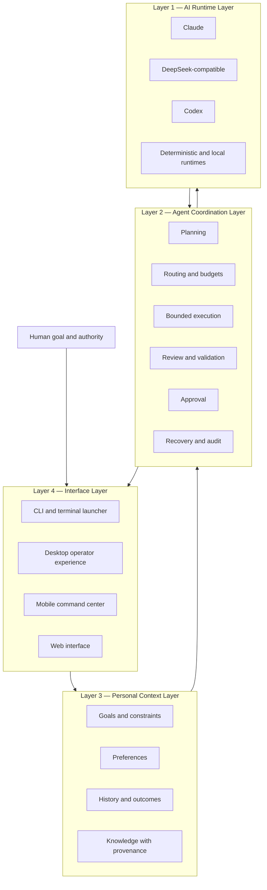

# FlowFoundry Product Architecture

Status: canonical product-level architecture
Current product maturity: Alpha
Runtime evidence baseline: `release/v0.2.0-alpha.1-candidate` at `64f1563…`
Documentation-integrated candidate: `release/v0.2.0-alpha.1-final-candidate`

## Product definition

AI tools are fragmented. Each model, local tool, project, data source, and
provider has different strengths, cost, privacy, permissions, and failure
behavior. Adding more models does not solve the user's coordination problem.

FlowFoundry is a **Personal AI Coordination Layer**. It translates a human goal
and constraints into the minimum sufficient, reviewable workflow across
available intelligence resources.

FlowFoundry does not compete with models. It coordinates models.

```text
Problem:  AI tools are fragmented
Insight:  More models do not create coordination
Solution: FlowFoundry manages goals, capabilities, context, resources,
          permissions, execution, review, and recovery
```

## Unified system view



Privacy, permission, cost, provenance, human authority, and evidence are
cross-layer controls. No interface or model may bypass them.

# Layer 1 — AI Runtime Layer

The runtime layer supplies replaceable intelligence and deterministic
capabilities. Provider brands are adapters, not the product's durable contract.

## Current adapters and boundaries

| Runtime | Current status | Honest boundary |
|---|---|---|
| Codex | Experimental real adapter; deterministic offline identity available | Bounded live writer evidence exists; provider parity is incomplete |
| DeepSeek | Experimental Claude-compatible isolated profile | Not a standalone native runtime in this repository |
| Claude | Experimental direct profile and provider identity | Live compatibility is not equally verified across versions |
| Deterministic local tools | Implemented | Provide reproducible offline execution and validation |
| General local models | Planned | No complete local-model engine or hardware scheduler exists |

Each runtime is described by capability, readiness, authentication state,
privacy/locality, cost class, context limit, workspace compatibility, and
concurrency. `READY` is evidence about a specific runtime profile, not a claim
that every task or workspace can use it.

## Runtime contract

A provider receives a trusted task envelope with bounded context, schema,
permission scope, tool policy, workspace, and budget. It returns a candidate
result and measured usage when available. It cannot approve itself, widen its
tools, invent authority, or directly publish an effect.

# Layer 2 — Agent Coordination Layer

This is FlowFoundry's implemented core and the main reason it is more than an AI
workspace launcher.

## Planning

Rule-based profiling selects a minimum sufficient path:

- one agent for a bounded simple task;
- one agent plus independent review for higher risk or uncertainty; or
- a bounded team/Meeting for cross-domain work.

Explicit versioned DAGs remain available when the workflow is already known.

## Routing

Routing filters by readiness, capability, permission, workspace compatibility,
concurrency, and policy before ranking eligible agents. Cost and outcome history
can influence an eligible choice, but current routing is explainable heuristic
selection—not learned universal optimization.

## Review

Model output remains a candidate until structured review and deterministic
validation establish what is supported. Review decisions are durable and can
block dependent work. Dissent is preserved rather than erased by an unbounded
agent debate.

## Approval

Review quality and execution authority are separate. Hazardous actions stop at
a persisted human approval gate. An approval grants one declared scope; it does
not create general autonomy.

## Recovery

Plans, attempts, artifacts, reviews, approvals, usage, process handles, and Git
candidate ownership survive interruption. Recovery reconciles state without
repeating completed side effects. Physical cancellation fails closed if the
local agent cannot verify process identity.

## Workspace isolation

Write-capable real tasks use immutable-base managed Git worktrees and exclusive
writer leases. Failed or dirty candidates are retained for review. The current
runtime does not automatically merge, push, open a pull request, deploy, or
publish.

# Layer 3 — Personal Context Layer

This layer is primarily future work. The current repository stores bounded task
context and operational outcome statistics; it does not implement a complete
personal semantic memory system.

## Preferences

Durable preferences must be explicit or confirmed, scoped, inspectable,
correctable, exportable, and reversible. A temporary task choice must not
silently become a permanent preference.

## History

Useful history records decisions and verified outcomes—not just chat
transcripts. It should distinguish success, failure, review, cost, latency,
user correction, and discarded results.

## Goals

Goals connect long-term intent to current work. They require scope, priority,
deadline, privacy, budget, and user authority. The system may recommend a plan;
it does not redefine the user's goal without confirmation.

## Knowledge

Personal knowledge requires provenance, freshness, retention, project scope,
provider-disclosure policy, and retrieval receipts. Users must be able to
inspect, correct, export, expire, forget, or disable the context layer.

## Context boundary

Personal data remains local by default. Before content reaches a remote model,
policy decides whether it is necessary, permitted, and appropriately redacted.
No mobile or web interface stores provider credentials or becomes an
unrestricted path into personal files.

# Layer 4 — Interface Layer

Interfaces express goals and human decisions. They do not own execution
authority.

## Desktop and terminal

Current: an adaptive terminal launcher, line-oriented compatibility path,
project discovery, provider profiles, permission selection, and CLI operations.
This is the mature user surface today.

## CLI

Current: catalog validation, component listing, planning, run/status/review/
report, retry/resume, approval, cancellation, and provider readiness. The CLI
is the reference interface for reproducible Alpha evidence.

## Mobile

Designed, not implemented: an iPhone-first PWA that acts as a human approval
and intelligence interface. It shows projects, AI team status, tasks, costs,
warnings, approval cards, and an execution timeline. It is not remote desktop,
raw terminal streaming, or a provider credential store.

## Web

Planned: a versioned control UI built on the same typed commands, events,
capability policy, and approval contracts as mobile. A web UI must not create a
second, weaker execution path.

## End-to-end product flow

```text
Human goal
  -> understood context and constraints
  -> capability requirements
  -> eligible models and tools
  -> minimum sufficient plan
  -> no-effect execution
  -> exact approval when an effect is ready
  -> validation and independent review
  -> result, evidence, cost, and recoverable history
```

## Product scenarios

### Developer release

This is the strongest near-term Alpha demo because it maps to implemented
capabilities. The user asks, “Prepare my GitHub release.” FlowFoundry verifies
the project and immutable candidate, runs tests, reviews documentation and
security evidence, prepares notes, and stops before write/push/tag/publication
approval. It does not claim an unauthorized release.

### Student learning and career plan

This is a strong vision demo, not a current Alpha capability claim. A future
context layer could use user-selected schedules, documents, goals, knowledge
gaps, learning preferences, and confirmed past mistakes to coordinate research,
planning, and review agents. Every source and recommendation would require
provenance and user control.

## Architectural invariants

1. Humans own goals and consequential decisions.
2. Capabilities and policies are more durable than provider brands.
3. Use the minimum sufficient path.
4. Trusted code owns side effects; model text does not.
5. Personal context is consent-based, scoped, and portable.
6. Unknown cost and uncertain state remain visible as unknown.
7. Every consequential run is reviewable, recoverable, and auditable.
8. Mobile and web are command interfaces, not remote shells.

## Document responsibilities

- [Architecture](ARCHITECTURE.md) describes current engineering internals.
- This document is the canonical product-layer map.
- [Vision](VISION.md) explains the long-term thesis.
- [Personal AI Manager](PERSONAL_AI_MANAGER.md) describes context and adaptive
  management requirements.
- [Mobile AI Command Center](MOBILE_AI_COMMAND_CENTER.md),
  [Remote Agent Architecture](REMOTE_AGENT_ARCHITECTURE.md), and
  [Mobile Security Model](MOBILE_SECURITY_MODEL.md) define the designed mobile
  surface and trust boundaries.
- [Product Roadmap](PRODUCT_ROADMAP.md) is the canonical staged roadmap.
- [Personal AI OS Strategy](PERSONAL_AI_OS_STRATEGY.md) defines product-stage
  progression without replacing those detailed specifications.

## Non-goals

FlowFoundry does not claim AGI, universal AI, model superiority, autonomous
human replacement, or automatic access to a person's data. Productization
should improve trust, usability, community adoption, and validated outcomes
before expanding architectural complexity.
