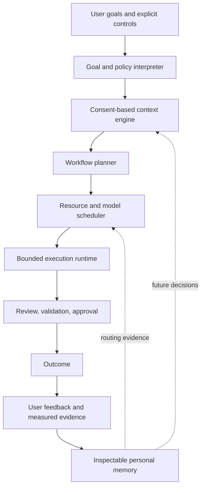

# Personal AI Manager

## Direction

The future FlowFoundry product is a personal AI manager: a user-controlled
coordination system that understands a goal, identifies available resources,
and assembles the smallest safe workflow that can help.

This document is a design direction. The current repository implements the
coordination foundation; it does not yet implement a complete personal context
engine or adaptive manager.

Within the [unified product architecture](FLOWFOUNDRY_PRODUCT_ARCHITECTURE.md),
this design primarily describes the future Personal Context Layer and its
feedback into the implemented Agent Coordination Layer.

## What the manager coordinates

### Models

Cloud models, specialized coding or reasoning models, and local private models
should be selected by capability and constraints rather than brand loyalty.

Selection signals may include task type, quality history, context capacity,
latency, price, quota, data policy, and current availability. Users should be
able to override the choice and understand why it was made.

### Tools

The manager can coordinate reviewed tools for code, documents, data analysis,
automation, and communication. A tool is a capability with a trust boundary,
not an unrestricted shell handed to model text.

Each tool needs declared inputs, outputs, permissions, validation, failure
behavior, and approval requirements.

### Knowledge

A personal context engine can provide approved project facts, documents,
preferences, decisions, and past outcomes. Context should carry provenance and
retention policy, and the user must be able to inspect, correct, export, or
forget it.

### Workflows

The manager should reuse workflows that succeeded, while keeping their stages
visible: planning, research, generation, review, validation, approval, and
delivery. Reuse should be versioned and reversible, not an invisible automation
habit.

### Resources

Money, time, compute, quotas, privacy, and human attention are all scheduling
resources. A personal AI manager should optimize within a user-declared budget
instead of maximizing model calls.

## Proposed architecture



The current FlowFoundry runtime corresponds primarily to planning, bounded
execution, review, approval, and operational evidence. The consent, semantic
context, resource optimization, and adaptive feedback loops are planned.

## Personal memory system

A credible memory layer must do more than append chat transcripts. It should
separate:

- **facts** with source and freshness metadata;
- **preferences** explicitly provided or confirmed by the user;
- **decisions** with project scope and rationale;
- **workflow evidence** such as cost, latency, validation, and review outcomes;
- **temporary context** with automatic expiration;
- **sensitive context** with stricter locality and access policy.

Required controls include per-item provenance, scope, retention, correction,
export, deletion, encryption strategy, and a way to run without memory.

## Local private user data layer

Personal data should remain local by default and be disclosed to remote models
only through an explainable context policy. A future data layer should support:

- local encrypted storage with user-controlled keys;
- explicit collections and project boundaries;
- content classification and provider disclosure rules;
- retrieval receipts showing which sources entered a task;
- redaction or local summarization before remote use;
- complete export and deletion workflows.

The current repository does not provide this complete data layer.

## AI resource scheduler

A resource scheduler can choose among eligible paths using a constraint set:

```text
required capability
+ privacy policy
+ maximum cost
+ deadline / latency target
+ available compute and quota
+ validation requirement
+ historical outcome quality
```

The first versions should remain deterministic and explainable. A later learned
policy may rank eligible paths, but it should never bypass hard safety,
permission, or budget constraints.

## Model selection intelligence

Generic benchmarks are weak evidence for a person's real workflows. FlowFoundry
can eventually compare providers using local outcome evidence:

- did validation pass;
- did a reviewer block the result;
- how many retries were required;
- what did the call cost and how long did it take;
- did the user accept, revise, or discard the result;
- was the context disclosure appropriate.

This makes selection personal and task-specific without claiming that the
system has discovered a universally best model.

## Personal workflow optimization

Optimization should propose changes, not silently rewrite how a person works.
Examples include suggesting a cheaper first pass, adding review to a failure-
prone step, reusing an approved template, or running a private local model for
sensitive preprocessing.

Every adaptation should be inspectable, reversible, scoped, and supported by
enough evidence to explain why it was suggested.

## Enterprise extension

The same coordination contracts could support organizations with additional
controls:

- identity and role-based policy;
- tenant and project data boundaries;
- approved provider and model registries;
- centralized quota and cost allocation;
- compliance evidence and audit exports;
- organization workflow catalogs and review requirements.

Enterprise coordination is a future extension, not a current repository
feature. It should reuse open contracts rather than turn the personal system
into an opaque control plane.

## Success criteria

A successful personal AI manager should help a person achieve better outcomes
with fewer unnecessary calls, less repeated setup, safer context handling, and
clearer control. It should be judged by user value, recoverability, and trust—not
by the number of agents it can run.

See [VISION.md](VISION.md), [PRODUCT_ROADMAP.md](PRODUCT_ROADMAP.md), and
[CURRENT_STATUS.md](CURRENT_STATUS.md).
