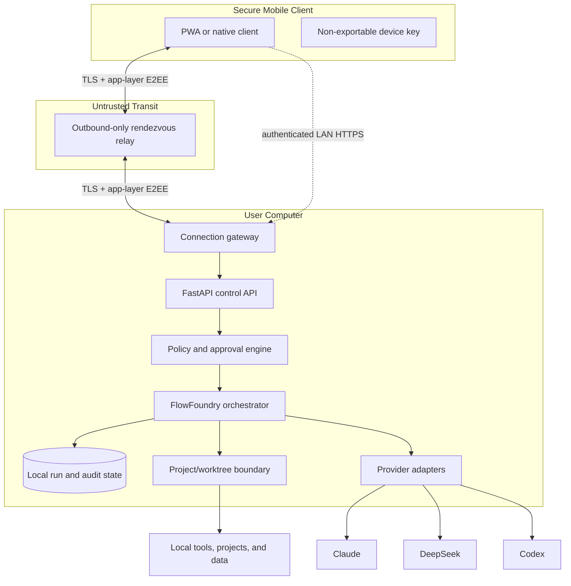
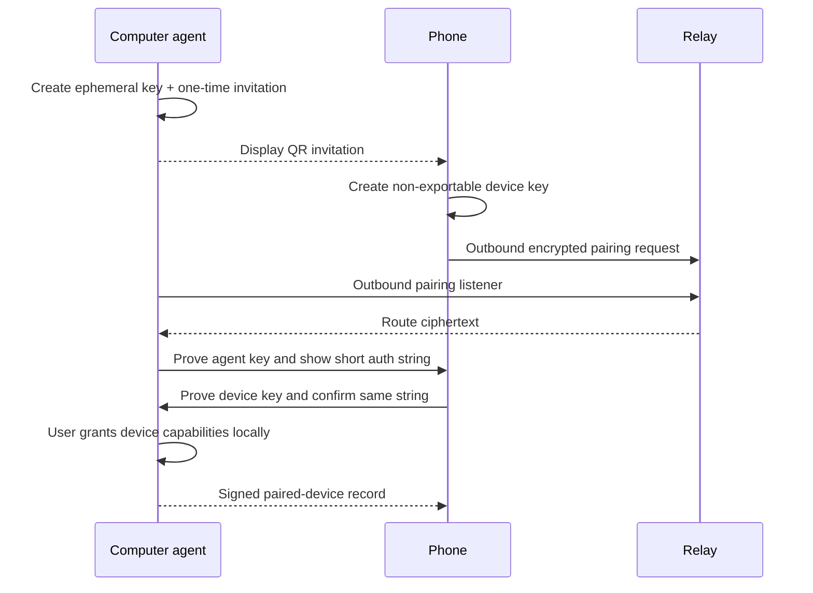

# Remote Agent Architecture

Status: architecture design; not implemented

## Decision summary

The mobile command center uses a **control plane**, not a remote desktop data
plane. The local computer remains the execution authority. Remote access uses
outbound connections from both phone and computer, end-to-end encrypted command
envelopes, scoped capability grants, and durable local state.

The PWA must work in two connectivity modes:

1. **Local direct:** paired phone and computer communicate over an authenticated
   local HTTPS endpoint when on the same trusted network.
2. **Remote rendezvous:** both devices make outbound TLS connections to a small
   relay. Application-layer encryption prevents the relay from reading task
   content or approvals.

The local agent exposes no default public inbound port. Direct internet port
forwarding, UPnP, remote shell, and screen streaming are out of scope.

## System context



The relay sees device-routing identifiers, ciphertext sizes, timestamps, and
connection metadata. It does not receive decryption keys, provider credentials,
plaintext goals, file contents, approval details, or execution logs.

## Component responsibilities

### Secure mobile client

- owns a per-device signing/encryption key;
- stores no provider API keys, passwords, SSH keys, or private credential files;
- submits signed goal, cancel, and approval envelopes;
- renders plans and redacted event streams;
- validates the paired agent identity and event signatures; and
- maintains the last acknowledged event sequence for replay.

### Connection gateway

- maintains outbound relay connectivity and optional authenticated LAN HTTPS;
- terminates transport TLS but passes only authenticated application envelopes;
- rate-limits by paired device and message class;
- rejects unknown, revoked, expired, replayed, or oversized envelopes; and
- contains no orchestration or provider logic.

### FastAPI control API

- validates request schemas and idempotency keys;
- maps mobile requests to local command objects;
- provides snapshots and paginated event replay;
- never accepts arbitrary executable command strings from the mobile client;
- returns redacted summaries and artifact handles, not unrestricted paths; and
- remains bound to loopback or a controlled local socket by default.

### Policy and approval engine

- resolves device capabilities, project scope, privacy policy, cost ceiling,
  and action risk;
- creates exact, immutable approval proposals;
- verifies signatures, nonce, expiry, action digest, and current state;
- prevents a model, relay, or phone UI from widening authority; and
- records allow, reject, expire, and revoke decisions locally.

### FlowFoundry orchestrator

- profiles goals and creates the minimum sufficient plan;
- routes only to ready, permitted capabilities;
- persists attempts, reviews, approvals, cost evidence, and cancellation state;
- allocates managed Git worktrees for write-capable agents;
- owns provider process lifecycle; and
- publishes safe events through an outbox after local state commits.

### Local state

The source of truth is on the computer. It stores paired device public keys,
capability grants, run metadata, event sequences, approval records, artifact
references, and revocation state with restrictive filesystem permissions.

Provider credentials remain in existing provider-specific local stores or OS
credential facilities. FlowFoundry records credential source names and readiness
states, never secret values.

## PWA MVP deployment

```text
Mobile Safari
  -> installed PWA shell
  -> HTTPS relay endpoint
  -> encrypted WebSocket channel
  -> local agent outbound WebSocket
  -> loopback FastAPI service
  -> FlowFoundry runtime
```

Recommended Phase 1 stack:

- FastAPI for versioned HTTP control endpoints;
- WebSocket for resumable events and command acknowledgements;
- SQLite or the existing durable file model for local outbox/idempotency state;
- Web Crypto for device keys and application-envelope encryption;
- HTTPS everywhere;
- QR pairing with a short-lived invitation; and
- a service worker for installability and a read-only cached shell.

The service worker must not cache goals, file excerpts, diffs, approvals, or
execution artifacts unless an explicit encrypted offline-data design is added.

## Pairing protocol

The QR code is an invitation, not a long-lived bearer credential. It contains:

- protocol version;
- agent instance ID;
- agent ephemeral public key;
- connection/rendezvous hint;
- random invitation nonce;
- expiration; and
- human-verifiable fingerprint material.

Pairing sequence:



The invitation is single-use and short-lived. Pairing fails closed on clock
skew beyond policy, fingerprint mismatch, replay, or interrupted confirmation.

## Command and event envelopes

Every client command contains:

- protocol and schema version;
- device ID, agent ID, and key ID;
- command ID and idempotency key;
- monotonically increasing device counter;
- issued-at and expiry timestamps;
- command type and typed payload;
- requested capability and project scope; and
- signature over the canonical envelope.

Every event contains:

- run ID and task ID;
- monotonic event sequence;
- previous-event hash or stream checkpoint;
- event type and safe payload;
- committed-at timestamp; and
- local-agent signature.

Initial command types should be deliberately narrow:

- `goal.submit`
- `plan.accept`
- `run.pause_scheduling`
- `run.cancel_request`
- `approval.allow`
- `approval.reject`
- `snapshot.request`
- `events.ack`

There is no `shell.execute`, `file.read_arbitrary`, `permission.set_unbounded`,
or provider-secret command.

## State and delivery semantics

The architecture uses at-least-once transport with exactly-once local effect
guards:

1. authenticate and decrypt envelope;
2. validate schema, capability, scope, counter, expiry, and idempotency key;
3. persist the command receipt;
4. commit the local state transition or exact action reservation;
5. execute only through trusted local code;
6. persist result and outbox event; and
7. acknowledge the command.

Reconnect requests events after the last acknowledged sequence. Duplicate
commands return the stored result and never repeat a completed side effect.

## Approval integration

An approval is bound to a canonical action manifest, for example:

```json
{
  "action": "git.push_exact_sha",
  "project_id": "flowfoundry",
  "local_sha": "<exact-approved-sha>",
  "remote_id": "origin",
  "remote_ref": "refs/heads/<approved-candidate-ref>",
  "force": false,
  "max_cost": "0.00",
  "expires_at": "2026-08-24T16:00:00+08:00",
  "nonce": "single-use-random-value"
}
```

The stored approval contains the manifest digest, approver device, policy
version, signature, expiry, and consumption result. A changed SHA, ref, remote,
force flag, cost, or action type requires a new approval.

## API surface for Phase 1

Read-oriented endpoints:

- `GET /v1/status`
- `GET /v1/projects`
- `GET /v1/agents`
- `GET /v1/runs/{run_id}`
- `GET /v1/runs/{run_id}/events?after={sequence}`
- `GET /v1/approvals`
- `GET /v1/artifacts/{artifact_id}/summary`

Command endpoints:

- `POST /v1/goals`
- `POST /v1/plans/{plan_id}/accept`
- `POST /v1/runs/{run_id}/pause`
- `POST /v1/runs/{run_id}/cancel`
- `POST /v1/approvals/{approval_id}/decision`
- `POST /v1/devices/{device_id}/revoke`

`GET /v1/events` upgrades to a WebSocket and supports authenticated replay.
Endpoint availability is further constrained by the paired device's capability
grant.

## Failure behavior

| Failure | Required behavior |
|---|---|
| Relay unavailable | Local runs continue; mobile shows last verified state as stale |
| Phone disconnects | No approval is inferred; run stops at required gate |
| Computer disconnects | Commands remain unexecuted or return unknown until reconciled locally |
| Duplicate command | Return stored receipt; do not repeat effect |
| Event gap | Request replay from last checkpoint |
| Revoked device | Reject before command parsing beyond minimal envelope metadata |
| Provider process uncertain | Mark unknown/blocked; do not claim cancellation or success |
| Cost data unavailable | Display unknown and apply configured ask-before-paid-call policy |

## Observability and privacy

Metrics may count connections, encrypted message sizes, latency, state
transitions, retries, and error classes. Logs must avoid plaintext goals, file
contents, prompts, diffs, approval payloads, device private keys, bearer tokens,
and provider output. Local audit records may retain redacted action manifests
and hashes according to user-configured retention.

## Architecture acceptance criteria

- No local public port is required for remote operation.
- Relay compromise does not disclose command/event plaintext or enable a valid
  approval.
- Replayed or reordered commands fail without side effects.
- A phone can be revoked locally while offline; revocation applies when a relay
  connection resumes.
- Restarting the local agent restores run, event, idempotency, and approval state.
- The PWA can reconnect and render a complete, ordered timeline.
- All provider execution and secret access remain on the computer.

## Decision risks and evidence

| Decision | Reason | Risk | Evidence required before shipping |
|---|---|---|---|
| Outbound rendezvous relay | Remote access without public local port | Metadata leakage and relay availability | E2EE audit, traffic analysis, outage tests |
| Local source of truth | Preserve privacy and recovery | Computer unavailable remotely | Durable state and stale-state UX tests |
| Typed commands only | Prevent mobile shell exposure | Slower feature expansion | Schema fuzzing and capability tests |
| At-least-once transport | Tolerate mobile connectivity | Duplicate effects | Idempotency and crash-recovery tests |
| Exact action approvals | Preserve human authority | More approval prompts | Approval usability and bypass tests |
