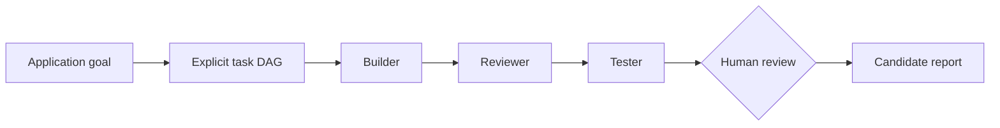

# Demo 2 — AI Project Manager

**Maturity:** Alpha synthetic lifecycle. Explicit planning, capability routing,
builder/reviewer/tester dependencies, reporting, and offline execution exist.
A dedicated research provider and automatic project delivery do not.

## Problem

“Build an application” is not one reliable model call. The user needs a visible
plan, scoped implementation, independent review, deterministic validation, and
a decision point before integration.

The official release demo focuses on coordination mechanics rather than claiming
that a fake provider built production software.

## Input

The bundled input is
`examples/orchestration/codex-builder-deepseek-reviewer.json`. It declares:

- a builder task requiring implementation and workspace write permission;
- a read-only reviewer dependent on the builder;
- a tester dependent on review;
- expected outputs, retry limit, and validation-command declarations.

All task content is synthetic. The default command uses no network, account, or
provider credential.

## Workflow



Run:

```bash
flowfoundry team run \
  examples/orchestration/codex-builder-deepseek-reviewer.json \
  --run-id ai-project-manager-demo
```

Inspect:

```bash
flowfoundry team status ai-project-manager-demo
flowfoundry team review ai-project-manager-demo
flowfoundry team report ai-project-manager-demo
```

Do not use `--enable-real-provider` in the official first-release recording.

## Agent coordination

- The explicit DAG fixes task order and prevents an unbounded conversation.
- Capability routing maps implementation, review, and testing requirements to
  eligible registry identities.
- Dependencies prevent review before build and testing before review.
- The fake provider makes every stage deterministic and records zero token cost.
- In real write-capable runs, FlowFoundry allocates a managed Git worktree and
  validates the exact candidate. The offline demo does not claim that a real
  writer or candidate diff was produced.
- Human approval remains separate from run completion and integration.

## Output

The demo produces a contained local run directory and JSON output showing:

- build, review, and test task states;
- selected agent identities and isolation mode;
- dependency progression and attempts;
- synthetic provider usage, latency, token, and cost fields;
- review records and an aggregated final report.

The product value demonstrated is inspectable coordination and recoverable
state—not application quality from fake content.

## Limitations

- No dedicated Research Agent exists in the default registry.
- Offline validation commands are declarations in this synthetic path; fake
  provider completion is not proof that a real application passed them.
- Real Codex/DeepSeek-compatible execution has bounded smoke evidence but is not
  the public default demo.
- Automatic merge, pull request, deployment, and release are intentionally out
  of scope.
- The current dirty release-preparation tree is not suitable for demonstrating
  writer isolation until a clean sanitized candidate exists.

## Release verification

- [ ] Fresh approved checkout completes the run with the documented command.
- [ ] Build, review, and test each complete once in dependency order.
- [ ] Status, review, and report commands reopen persisted state.
- [ ] Provider use is visibly labeled fake/offline.
- [ ] Main working tree remains unchanged.
- [ ] Recording never implies a production application was generated or tested.
