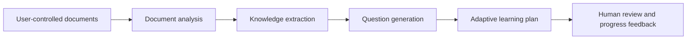

# Demo 2 — Personal Learning Assistant

**Maturity:** Concept only. It depends on a personal document/context layer that
is not implemented in the current repository.

## User outcome

The user has five hundred pages of material and wants an achievable learning
plan rather than a generic summary.

> Help me understand these documents and prepare for an exam in four weeks.

## Product behavior

1. The user selects a local document collection and disclosure policy.
2. A deterministic ingest step extracts text, page references, hashes, and
   document metadata without modifying originals.
3. A document agent builds concepts and claims with citations back to pages.
4. A question agent generates recall and application questions tied to those
   concepts.
5. The planner fits sessions to the user's time, goals, and confirmed baseline.
6. Progress feedback changes future emphasis only after the user can inspect the
   evidence and reset the adaptation.

## Required architecture not yet present

- document ingestion, OCR, chunking, and citation contracts;
- local encrypted knowledge collections;
- retrieval receipts and provider disclosure rules;
- learner profile, progress model, retention, export, and forgetting controls;
- evaluation fixtures for citation faithfulness and question quality;
- a learning-specific UI.

The existing orchestration runtime can eventually coordinate these components,
but it does not make them exist today.

## GIF storyboard

| Time | Frame | Message |
|---:|---|---|
| 0–10s | Select local collection | “Your documents remain under your control” |
| 10–25s | Ingest receipt | “Every extracted section keeps source provenance” |
| 25–42s | Concept map with page links | “Knowledge stays traceable to the material” |
| 42–58s | Generated questions | “Practice targets the actual concepts” |
| 58–75s | Four-week plan | “Time and goals shape the schedule” |
| 75–90s | Inspect/forget controls | “Memory is visible, correctable, and removable” |

## Prototype acceptance checklist

- Uses only synthetic or explicitly user-provided documents.
- Original files are never modified.
- Every claim and question links to source pages.
- Remote disclosure is disabled by default and visible when enabled.
- The user can export and delete the learning context.
- The system clearly distinguishes document facts, model suggestions, and user
  confirmations.

